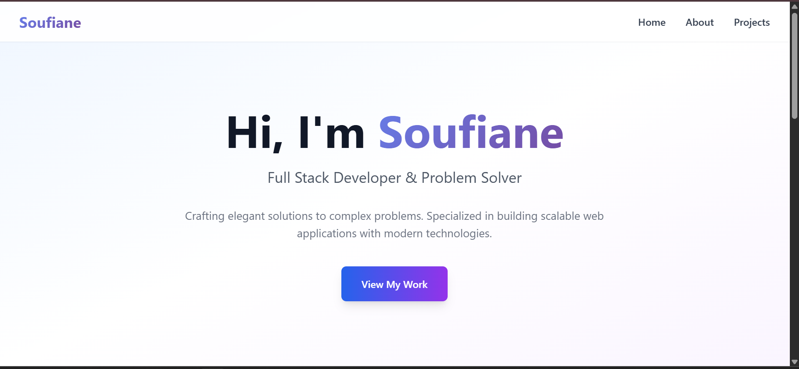

# Developer Portfolio Mini-Site
**Soufiane Aziz**  
*Supervised by: M. Essarraj Fouad*  
*Group: DM101*

---

## Analysis: Requirements Specification
- **Context**: Portfolio – Laravel 
- **Objective**: Profile –  Projects – Contact
- **For**: Ben Yekhlef Anouar
- **Users**: Recruiters – Clients – Students
- **Pages**: Home – Projects – Details – About - Skills - Contact
- **Design**: Clean – Responsive – blue and white for colors

---

## Analysis: Use Case Diagram

---

## Conception: Schema

---

## Conception: Class Diagram

---

## Conception: Maquette

